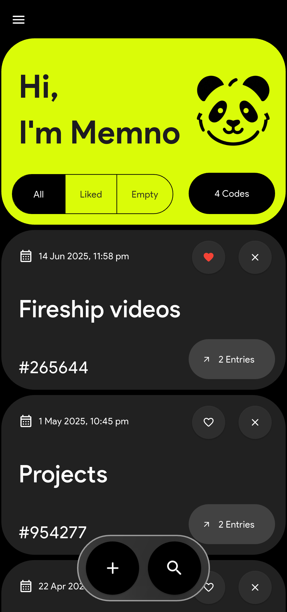
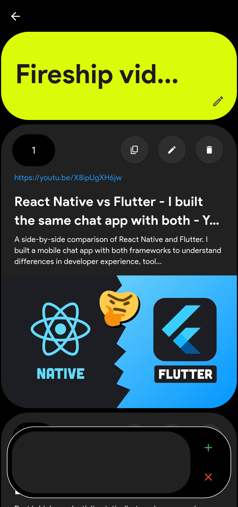
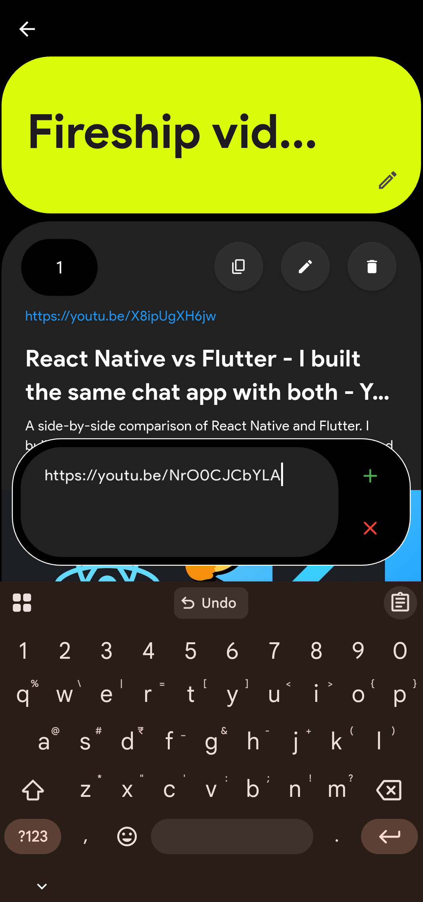

# 🧠 Memno — Save Links as Notes with Metadata Previews
<p align="center">
    
   
</p>

- Memno is a **Flutter-based mobile app** for saving important links along with personal notes. It auto-fetches rich metadata for each link, supports offline usage, and generates unique 6-digit codes for secure sharing.

- Think of it as your personal link + note vault with instant previews.


---

## ✨ Features

- 🔗 **Save links** with title, description, and image previews
- 🧾 **Write notes** for each saved item
- ⚡ **Instant metadata fetching** from any URL
- 🔒 **6-digit short code** to easily acces the saved URLs
- 🌗 **Dark mode support**
- 💾 **Offline-first design**
- 🛠 Built entirely with **Flutter**

---

## 📸 Screenshots

<p float="left">
    
    
    
</p>

---
## 🔧 Installation

- Just download the apk file from [here](https://github.com/jydv402/memno/releases/latest)
- Install it and BOOM! that's it! 

---

## 🧠 Use Cases

* Save useful articles with notes
* Maintain a curated list of resources
* Share annotated links via short codes
* Personal knowledge base on your phone

---

## 📂 Project Structure

```
lib/
├── components
│   ├── custom_overlay.dart
│   ├── inner_page.dart
│   ├── inner_page_fun.dart
│   ├── settings_page.dart
│   ├── show_toast.dart
│   └── sub_tile.dart
├── database
│   ├── code_data.dart
│   ├── code_data.g.dart
│   ├── toggles_data.dart
│   └── toggles_data.g.dart
├── functionality
│   ├── code_gen.dart
│   └── preview_map.dart
├── home.dart
├── main.dart
└── theme
    └── app_colors.dart

```

---

## 🧩 Built With

* Flutter
* Dart
* Provider
* Hive local database

---

## 🤝 Contributing

Contributions are welcome and appreciated!

To get started:

1. Fork this repository
2. Create a new branch (`git checkout -b memno-feature-xyz`)
3. Make your changes
4. Commit and push (`git commit -m "Added xyz"` → `git push origin memno-feature-xyz`)
5. Open a Pull Request

---

## 🛡 License

This project is licensed under the **MIT License** — see the [LICENSE](LICENSE) file for details.

---

## 📣 Support & Feedback

If you find this app useful:

- 🌟 Star the repo
- 🐞 Report any issues
- 📢 Spread the word with your friends

Let’s build something beautiful, simple, and helpful together.

---

> **Built with ❤️ by [JD](https://github.com/jydv402)** — striving to create tools that make life a little simpler.
